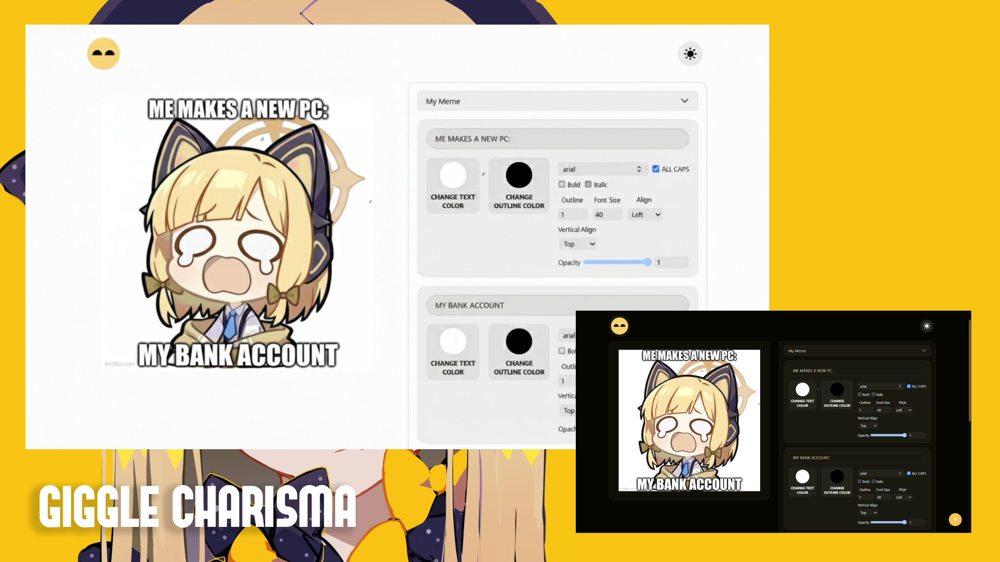
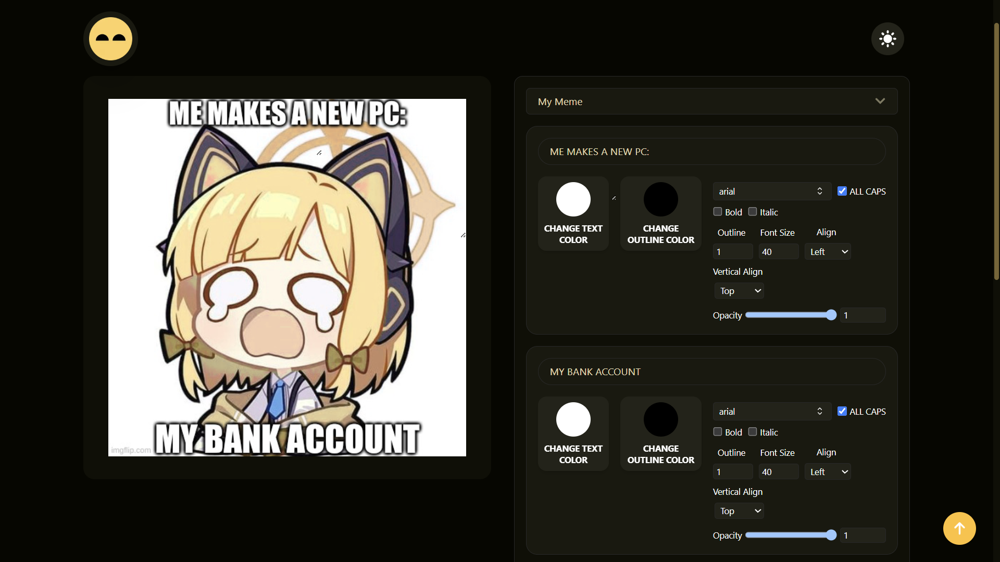
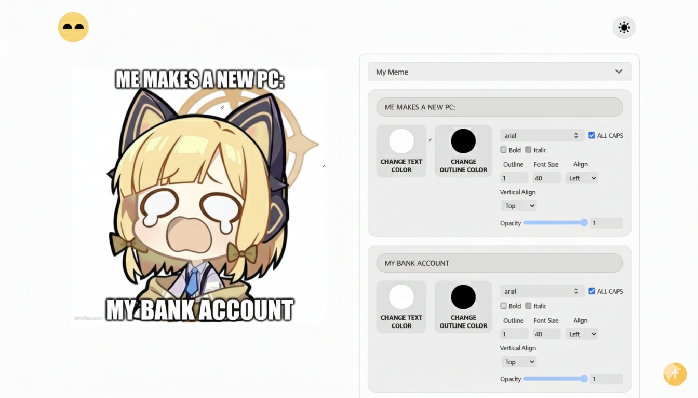

<p align="center">
  
</p>

<h1 align="center">🔰Giggle Charisma</h1>
<p align="center">
  <strong>A modern, responsive meme generator built with Next.js, React, Tailwind CSS, and Framer Motion.</strong>
</p>

<p align="center">
  
  
  
  
</p>

## Overview

Giggle Charisma is a browser-based meme maker that helps users create and download custom memes quickly. It fetches popular meme templates from the Imgflip API, lets users upload their own images, and provides editable text boxes with styling controls for color, outline, typography, alignment, opacity, and positioning.

The app is built with the Next.js App Router and includes responsive layouts, light/dark theme support, custom local fonts, generated metadata, favicon assets, and export-to-PNG functionality.

## Screenshots

<p align="center">
  
  
</p>

## Features

- Browse meme templates from the Imgflip meme API.
- Search templates by name.
- Upload a custom image and use it as a meme template.
- Auto-generate editable text fields based on each template's text box count.
- Drag and resize text boxes directly on the meme canvas.
- Toggle text box drag mode with a double click.
- Customize text content, color, outline color, outline width, font size, opacity, alignment, and vertical alignment.
- Choose from several bundled font families, including Arial, Impact, Open Sans, Roboto, Helvetica, Courier Prime, Georgia, Palatino, Garamond, Bookman, and Arial Black.
- Toggle all-caps, bold, and italic text styles.
- Download the finished meme as a PNG using `html-to-image`.
- Switch between light and dark themes with `next-themes`.
- Responsive interface for desktop and mobile screens.
- SEO metadata, Open Graph image generation, web manifest, favicon, and app icons.
- Custom loading, not-found, and error UI components.

## Tech Stack

| Area | Technology |
| --- | --- |
| Framework | Next.js 15 App Router |
| UI Library | React 19 |
| Styling | Tailwind CSS 4 |
| Animation and Dragging | Framer Motion |
| Image Export | html-to-image |
| Theme Handling | next-themes |
| Icons | react-icons |
| Data Fetching | Imgflip API, SWR dependency available |
| Image Optimization | Next Image, Sharp |

## Project Structure
```text id="5h3dqm"
giggle-charisma/
├── public/
│   ├── assets/
│   │   ├── fonts/
│   │   └── images/
│   ├── favicon.ico
│   └── site.webmanifest
├── screenshots/
│   ├── 1.png
│   └── 2.png
├── src/
│   ├── app/
│   │   ├── (main)/
│   │   │   ├── about/
│   │   │   ├── contact/
│   │   │   ├── works/
│   │   │   └── page.js
│   │   ├── error.js
│   │   ├── global-error.js
│   │   ├── layout.js
│   │   ├── manifest.js
│   │   ├── not-found.js
│   │   ├── opengraph-image.js
│   │   └── sitemap.js
│   ├── components/
│   │   ├── customs/
│   │   ├── error/
│   │   ├── home/
│   │   └── layout/
│   ├── lib/
│   │   ├── fontFamily.js
│   │   └── stateHandlers.js
│   ├── styles/
│   │   └── globals.css
│   └── utils/
│       └── getMemes.js
├── banner.png
├── package.json
└── README.md
```

## Getting Started

### Prerequisites

- Node.js 20 or newer
- npm, pnpm, yarn, or bun

### Installation

```bash
git clone <repository-url>
cd giggle-charisma
npm install
```

### Development

```bash
npm run dev
```

Open `http://localhost:3000` in your browser.

### Production Build

```bash
npm run build
npm run start
```

### Linting

```bash
npm run lint
```

## Available Scripts

| Command | Description |
| --- | --- |
| `npm run dev` | Starts the local development server with Turbopack. |
| `npm run build` | Creates a production build. |
| `npm run start` | Starts the production server. |
| `npm run lint` | Runs the configured Next.js lint command. |

## How To Use

1. Start the app and open the home page.
2. Select a meme template from the dropdown or upload your own image.
3. Use the generated text fields to write meme captions.
4. Adjust text color, outline, font, size, opacity, alignment, bold, italic, and all-caps options.
5. Drag each text box on the meme preview to position it.
6. Resize a text box from its corner when needed.
7. Click **Download Meme** to export the final image as `meme.png`.

#### Note
- Meme templates are loaded from `https://api.imgflip.com/get_memes`, so template browsing requires an internet connection.
- Custom uploads are handled locally in the browser with object URLs.
- The generated download captures the meme preview DOM node as a PNG.
- The app currently stores meme edits in React state only; edits are not persisted after refresh.

## Deployment

This project is ready for deployment on Vercel or any platform that supports Next.js.

For Vercel:

1. Push the project to a Git repository.
2. Import the repository in Vercel.
3. Keep the default Next.js build settings.
4. Deploy.

## License

This project is licensed under the MIT License. See [LICENSE](LICENSE) for details.

## Author

Ashish Kumar
